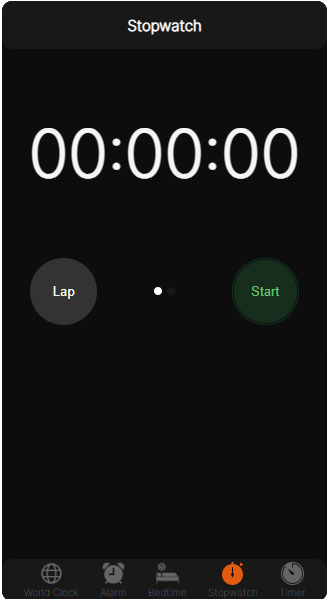

# React Stopwatch App 🕰️

A pixel-perfect recreation of Apple's stopwatch, built using React with TypeScript. Powered by Vite as the build tool.



## Features

Start, stop, and reset the stopwatch.
Record lap times.
A sleek and intuitive design mimicking Apple's native stopwatch.

## Technologies Used

### React:

For building the user interface.

### TypeScript:

Adds static typing to JavaScript ensuring a higher quality codebase.

### Vite:

A build tool that offers faster and leaner development experience for modern web projects.

## Getting Started Prerequisites

- Node.js (version 14 or higher recommended)
- npm (usually comes bundled with Node.js)

## Installation

Clone the repository:

```shell
git clone https://github.com/your-username/react-stopwatch-app.git
```

Navigate to the project directory:

```shell
cd react-stopwatch-app
```

Install the dependencies:

```shell
npm install
```

Start the development server:

```shell
npm run dev
```

The app should now be running on http://localhost:3000 (or another port if you've configured it differently).

## Usage

- Click "Start" to start the stopwatch.
- Click "Lap" to record a lap time.
- Click "Stop" to stop the stopwatch.
- When stopped, click "Reset" to reset the stopwatch and clear all lap times.
